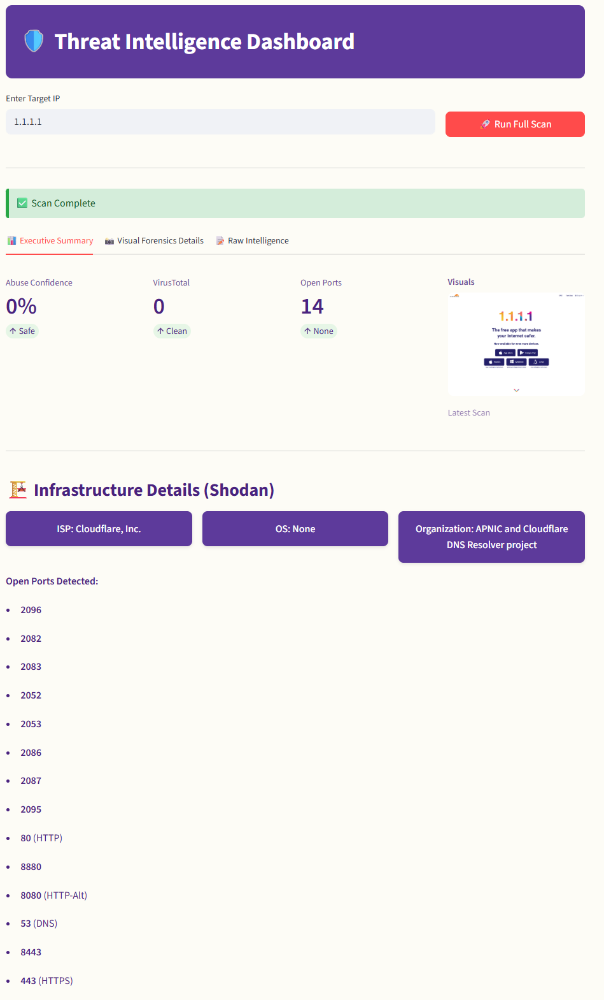

# 🛡️ Threat Intelligence Reputation Checker

A unified, automated threat intelligence dashboard designed to accelerate Incident Response (IR) and SOC analysis.


## 🎯 The Problem
Security Analysts often spend valuable time tab-switching between multiple intelligence sources (VirusTotal, AbuseIPDB, Shodan, urlscan.io) to investigate a single IOC (Indicator of Compromise).

## 💡 The Solution
This tool aggregates data from **4 industry-standard APIs** into a single Unified dashboard, providing a comprehensive risk profile in under 30 seconds.

## ✨ Key Features
- **🌐 Unified Reputation Analysis:** Cross-references AbuseIPDB confidence scores with VirusTotal voting consensus.
- **🏗️ Infrastructure Recon:** Integrates **Shodan** to identify host OS, ISP, and open ports (SSH, RDP, HTTP, etc.).
- **📸 Visual Forensics:** Automated headless browser scanning via **urlscan.io** to capture safe screenshots of potential phishing sites.
- **📊 Executive Dashboard:** A Streamlit-based UI with a custom "Dark Purple" theme, separating high-level metrics from raw JSON artifacts.
- **🧩 Modular Architecture:** Codebase is refactored into independent modules for scalability and easy maintenance.

## 🛠️ Tech Stack
* **Language:** Python
* **Frontend:** Streamlit (Custom CSS styling)
* **Networking:** `requests` library
* **Security:** Environment variable management (`python-dotenv`)

## 🚀 Installation & Setup

1.  **Clone the Repository**
    ```bash
    git clone [https://github.com/zhuiasdh/Reputation-checker](https://github.com/zhuiasdh/Reputation-checker)
    cd reputation-checker
    ```

2.  **Install Dependencies**
    ```bash
    pip install -r requirements.txt
    ```

3.  **API Configuration**
    Create a `.env` file in the root directory and add your keys:
    ```env
    ABUSEIPDB_API_KEY="your_key"
    VIRUSTOTAL_API_KEY="your_key"
    URLSCAN_API_KEY="your_key"
    SHODAN_API_KEY="your_key"
    ```

4.  **Launch the Dashboard**
    ```bash
    streamlit run app.py
    ```

## 📸 Screenshots


---
*Developed by Ziyi